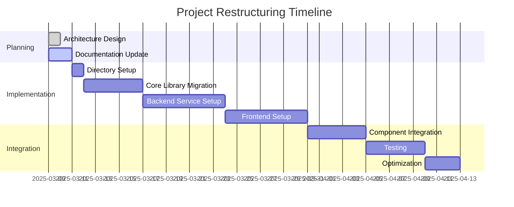

# Chess Video Analysis Application - Active Context

## Current Work Focus

We are currently restructuring the project to follow a cleaner, more modular architecture with three distinct components:

1. **chess-vision-lib**: Core library for chess video analysis
2. **chess-vision-service**: Backend REST API service
3. **chess-vision-web**: Frontend web application

This restructuring will improve separation of concerns, make the codebase more maintainable, and allow for independent development and deployment of each component.

### Restructuring Plan

1. **Phase 1: Restructure Core Library**
   - Move existing functionality from `chess_video_analyzer` to `chess-vision-lib`
   - Update imports and package structure
   - Create new pyproject.toml with updated dependencies
   - Ensure all tests are migrated and passing

2. **Phase 2: Create Backend Service**
   - Set up FastAPI project structure in `chess-vision-service`
   - Add dependency on local `chess-vision-lib`
   - Implement REST API endpoints
   - Set up service-specific tests

3. **Phase 3: Create Frontend Application**
   - Set up React/TypeScript project with RSPack in `chess-vision-web`
   - Set up ShadCN UI
   - Create component structure
   - Implement API client for backend service

## Recent Changes

- Updated memory bank documentation to reflect new project structure
- Designed new system architecture with clear component boundaries
- Planned migration path for existing code
- Defined interfaces between components

## Next Steps

### Immediate Tasks

1. **Create New Directory Structure**
   - Create top-level directories for each component
   - Set up initial project files and configuration

2. **Migrate Core Library**
   - Move existing code to new structure
   - Update imports and dependencies
   - Ensure functionality is preserved

3. **Set Up Backend Service Skeleton**
   - Create FastAPI application structure
   - Define API endpoints
   - Implement integration with core library

4. **Set Up Frontend Application Skeleton**
   - Create React application structure
   - Set up build configuration
   - Define component hierarchy

### Upcoming Milestones

1. **Milestone 1: Core Library Migration**
   - Complete migration of existing functionality
   - Update tests to work with new structure
   - Ensure all features work as before

2. **Milestone 2: Backend Service Implementation**
   - Implement REST API endpoints
   - Add video stream processing
   - Create integration with core library

3. **Milestone 3: Frontend Application Development**
   - Implement UI components
   - Connect to backend API
   - Add Lichess board integration

4. **Milestone 4: End-to-End Integration**
   - Connect all components
   - Test full workflow
   - Optimize performance

## Active Decisions and Considerations

### Technical Decisions

1. **Package Structure**
   - Using separate top-level directories for each component
   - Maintaining Python package naming conventions
   - Ensuring clean dependency management

2. **Library Interface**
   - Designing clean API for chess-vision-lib
   - Ensuring backward compatibility where possible
   - Documenting public interfaces

3. **Service Architecture**
   - Planning REST API endpoints
   - Considering authentication requirements
   - Designing for scalability

4. **Frontend Structure**
   - Organizing components by feature
   - Planning state management approach
   - Designing UI/UX for optimal user experience

### Open Questions

1. **Dependency Management**
   - How to manage dependencies between components during development?
   - What's the best approach for versioning the library?

2. **Testing Strategy**
   - How to ensure test coverage during migration?
   - What integration tests are needed for the new structure?

3. **Deployment Considerations**
   - How will the components be deployed together?
   - What containerization strategy should be used?

4. **Development Workflow**
   - How to coordinate development across components?
   - What branching strategy should be used?

## Current Development Status

We are currently in the planning phase, updating documentation and preparing for the implementation of the new structure. The focus is on ensuring a smooth transition while maintaining all existing functionality.
