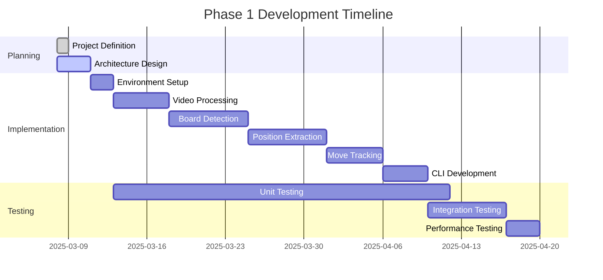

# Chess Video Analysis Application - Active Context

## Current Work Focus

We are currently in the initial planning and setup phase of the Chess Video Analysis Application. The project is structured into three distinct phases, with our immediate focus on **Phase 1: Python Library Development**.

### Phase 1 Focus Areas

1. **Core Video Processing Pipeline**
   - Implementing frame extraction from video files
   - Developing board detection algorithms
   - Creating piece recognition functionality

2. **Chess Position Extraction**
   - Converting visual board state to FEN notation
   - Handling different piece sets and board styles
   - Implementing position validation

3. **Move Tracking**
   - Detecting changes between consecutive positions
   - Inferring moves from position differences
   - Validating moves against chess rules

4. **Command-Line Interface**
   - Creating a user-friendly CLI
   - Implementing video input handling
   - Developing visual feedback mechanisms

## Recent Changes

- Project initialization
- Memory bank creation and documentation
- Definition of project scope and requirements
- Technical architecture planning
- Development approach finalization

## Next Steps

### Immediate Tasks

1. **Environment Setup**
   - Create Python project structure
   - Set up development environment
   - Install required dependencies
   - Configure testing framework

2. **Core Components Implementation**
   - Develop video input handler
   - Implement frame extraction
   - Create board detection algorithm
   - Build position extraction functionality

3. **Chess Logic Integration**
   - Integrate python-chess library
   - Implement position validation
   - Develop move inference logic
   - Create PGN/FEN generation

4. **CLI Development**
   - Design command-line interface
   - Implement argument parsing
   - Create visual feedback mechanism
   - Develop output formatting

### Upcoming Milestones

1. **Milestone 1: Basic Video Processing**
   - Successfully extract frames from video
   - Detect chess board in frames
   - Normalize board perspective

2. **Milestone 2: Position Recognition**
   - Identify pieces on the board
   - Generate FEN notation for positions
   - Validate positions against chess rules

3. **Milestone 3: Move Tracking**
   - Detect changes between positions
   - Infer moves from position differences
   - Generate PGN notation for moves

4. **Milestone 4: Command-Line Tool**
   - Process video files via CLI
   - Display detected positions
   - Output PGN/FEN as moves are detected

## Active Decisions and Considerations

### Technical Decisions

1. **Board Detection Approach**
   - Considering contour detection vs. feature matching
   - Evaluating performance vs. accuracy tradeoffs
   - Testing with various board styles and lighting conditions

2. **Piece Recognition Strategy**
   - Evaluating template matching vs. machine learning approaches
   - Considering pre-trained models vs. custom training
   - Assessing performance requirements for real-time processing

3. **Move Inference Logic**
   - Determining how to handle ambiguous moves
   - Deciding on confidence thresholds for move detection
   - Implementing fallback strategies for uncertain cases

4. **Error Handling**
   - Defining approach for handling detection failures
   - Implementing recovery strategies for missed frames
   - Developing user feedback for processing issues

### Open Questions

1. **Performance Optimization**
   - How to balance accuracy and processing speed?
   - Which steps in the pipeline can be optimized?
   - Are there opportunities for parallel processing?

2. **Robustness**
   - How to handle varying lighting conditions?
   - What strategies for different board and piece styles?
   - How to manage camera movement or perspective changes?

3. **User Experience**
   - What level of visual feedback is most helpful?
   - How to present errors or low-confidence detections?
   - What configuration options should be exposed to users?

4. **Testing Strategy**
   - What test datasets should be created?
   - How to measure accuracy of the system?
   - What benchmarks should be established?

## Current Development Status

We are currently in the **Planning** phase, with active work on architecture design. The implementation phase will begin once the planning is complete and the development environment is set up.
