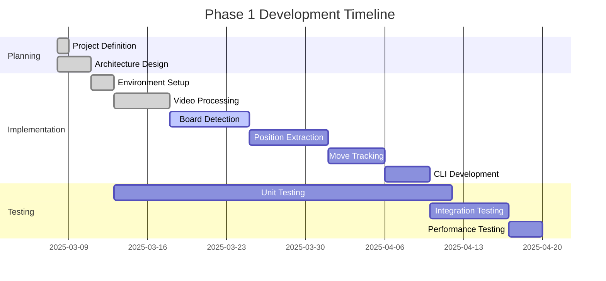

# Chess Video Analysis Application - Active Context

## Current Work Focus

We have completed the initial implementation of **Phase 1: Python Library Development** of the Chess Video Analysis Application. The core functionality for processing chess videos, detecting boards, extracting positions, and tracking moves has been implemented.

### Phase 1 Implementation

1. **Core Video Processing Pipeline**
   - Implemented frame extraction from video files
   - Developed board detection algorithms
   - Created piece recognition functionality (basic implementation)

2. **Chess Position Extraction**
   - Implemented position extraction from board images
   - Added position validation using chess rules
   - Created visualization for detected positions

3. **Move Tracking**
   - Implemented move detection between consecutive positions
   - Added support for special moves (castling, en passant, promotion)
   - Created PGN/FEN generation

4. **Command-Line Interface**
   - Created a user-friendly CLI
   - Implemented video input handling
   - Added visual feedback mechanisms
   - Implemented output formatting for PGN/FEN

## Recent Changes

- Created project structure with all necessary modules
- Implemented core video processing pipeline
- Added board detection and normalization
- Implemented position extraction and validation
- Added move tracking and notation generation
- Created visualization utilities
- Implemented command-line interface
- Added documentation and examples
- Set up testing framework

## Next Steps

### Immediate Tasks

1. **Testing and Refinement**
   - Create comprehensive test suite
   - Test with various chess videos
   - Refine board detection algorithm
   - Improve piece recognition accuracy

2. **Performance Optimization**
   - Optimize frame processing for better performance
   - Improve real-time processing capabilities
   - Reduce memory usage

3. **Feature Enhancements**
   - Add support for different board styles
   - Improve handling of different lighting conditions
   - Enhance move validation

4. **Prepare for Phase 2**
   - Design web service architecture
   - Plan API endpoints
   - Research streaming video processing

### Upcoming Milestones

1. **Milestone 1: Robust Board Detection**
   - Improve board detection accuracy
   - Handle various lighting conditions
   - Support different board styles

2. **Milestone 2: Advanced Position Recognition**
   - Enhance piece recognition
   - Improve position validation
   - Handle edge cases

3. **Milestone 3: Optimized Move Tracking**
   - Improve move detection accuracy
   - Handle complex moves more reliably
   - Optimize processing speed

4. **Milestone 4: Phase 2 Preparation**
   - Design web service architecture
   - Define API endpoints
   - Plan streaming video support

## Active Decisions and Considerations

### Technical Decisions

1. **Board Detection Approach**
   - Currently using contour detection with approximation
   - Need to evaluate performance with different board styles
   - Consider adding feature matching as an alternative approach

2. **Piece Recognition Strategy**
   - Current implementation uses basic image statistics
   - Need to implement template matching or machine learning approach
   - Consider creating a dataset of chess piece images

3. **Move Inference Logic**
   - Currently comparing board states and using chess rules
   - Need to improve handling of ambiguous moves
   - Consider adding confidence scores for detected moves

4. **Error Handling**
   - Basic error handling implemented
   - Need to add more robust recovery strategies
   - Consider adding logging for better debugging

### Open Questions

1. **Performance Optimization**
   - How to balance accuracy and processing speed?
   - Which steps in the pipeline can be optimized?
   - Are there opportunities for parallel processing?

2. **Robustness**
   - How to handle varying lighting conditions?
   - What strategies for different board and piece styles?
   - How to manage camera movement or perspective changes?

3. **User Experience**
   - What level of visual feedback is most helpful?
   - How to present errors or low-confidence detections?
   - What configuration options should be exposed to users?

4. **Testing Strategy**
   - What test datasets should be created?
   - How to measure accuracy of the system?
   - What benchmarks should be established?

## Current Development Status

We have completed the initial implementation of the core components and are now focusing on refining the board detection algorithms and improving the overall robustness of the system.
