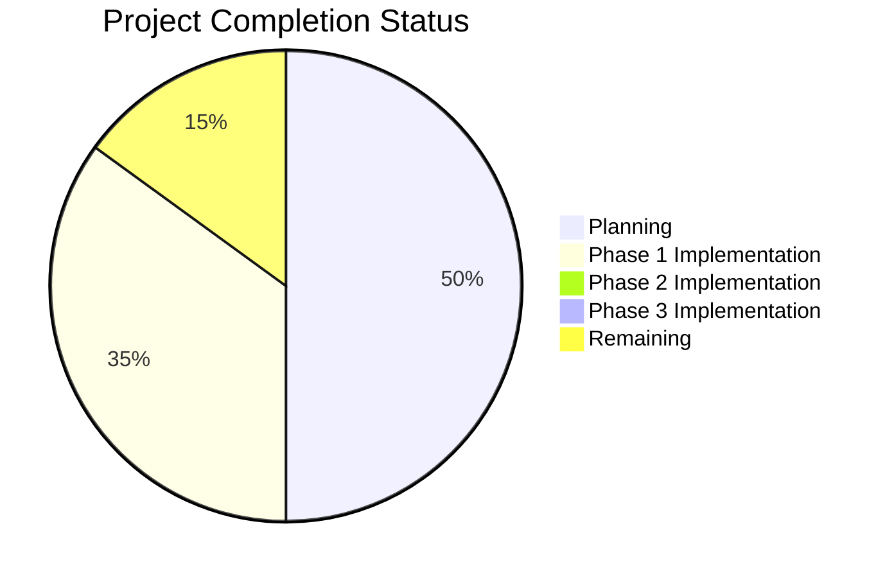

# Chess Video Analysis Application - Progress

## Project Status Overview

Current Status: **Phase 1 Initial Implementation Complete**

## What Works

- ✅ Project scope and requirements defined
- ✅ Technical architecture designed
- ✅ Development phases outlined
- ✅ Memory bank documentation established
- ✅ Project structure created
- ✅ Core video processing pipeline implemented
- ✅ Board detection algorithm implemented
- ✅ Position extraction implemented
- ✅ Move tracking implemented
- ✅ PGN/FEN generation implemented
- ✅ Command-line interface implemented
- ✅ Basic visualization system implemented
- ✅ Initial testing framework set up

## What's In Progress

- 🔄 Comprehensive test suite development
- 🔄 Board detection algorithm refinement
- 🔄 Piece recognition improvement
- 🔄 Performance optimization
- 🔄 Support for different board styles and lighting conditions

## What's Left to Build

### Phase 1: Python Library
- ⬜ Advanced piece recognition
- ⬜ Improved position validation
- ⬜ Enhanced move tracking
- ⬜ Comprehensive testing suite
- ⬜ Performance optimization
- ⬜ Support for different board styles
- ⬜ Better handling of lighting conditions

### Phase 2: Web Service
- ⬜ REST API design
- ⬜ Video stream handling
- ⬜ Backend service architecture
- ⬜ API endpoints implementation
- ⬜ Response formatting
- ⬜ Error handling
- ⬜ Performance optimization
- ⬜ Documentation

### Phase 3: Frontend
- ⬜ React application setup
- ⬜ TypeScript configuration
- ⬜ ShadCN UI integration
- ⬜ Video display component
- ⬜ Lichess board integration
- ⬜ API service integration
- ⬜ User controls
- ⬜ Responsive design
- ⬜ Testing and optimization

## Implementation Progress

### Backend Components

| Component | Status | Progress | Notes |
|-----------|--------|----------|-------|
| Video Input Handler | Implemented | 90% | Basic functionality working |
| Frame Extractor | Implemented | 90% | Basic functionality working |
| Board Detector | Implemented | 70% | Basic detection working, needs refinement |
| Position Extractor | Implemented | 60% | Basic extraction working, needs improvement |
| Move Tracker | Implemented | 70% | Basic tracking working, needs refinement |
| PGN/FEN Generator | Implemented | 80% | Basic generation working |
| Chess Logic Engine | Implemented | 70% | Using python-chess library |
| Command-Line Interface | Implemented | 80% | Basic functionality working |

### Web Service Components

| Component | Status | Progress | Notes |
|-----------|--------|----------|-------|
| REST API | Not Started | 0% | Phase 2 |
| Video Processor | Not Started | 0% | Phase 2 |
| Response Formatter | Not Started | 0% | Phase 2 |

### Frontend Components

| Component | Status | Progress | Notes |
|-----------|--------|----------|-------|
| Video Display | Not Started | 0% | Phase 3 |
| Chess Board Display | Not Started | 0% | Phase 3 |
| User Controls | Not Started | 0% | Phase 3 |
| API Integration | Not Started | 0% | Phase 3 |

## Testing Progress

| Test Type | Status | Progress | Notes |
|-----------|--------|----------|-------|
| Unit Tests | In Progress | 20% | Basic tests for video input |
| Integration Tests | Not Started | 0% | - |
| Performance Tests | Not Started | 0% | - |
| User Acceptance Tests | Not Started | 0% | - |

## Known Issues and Challenges

1. **Technical Challenges**
   - Piece recognition is currently very basic and needs improvement
   - Board detection may not work well in all lighting conditions
   - Move tracking needs refinement for special moves
   - Performance optimization needed for real-time processing

2. **Implementation Risks**
   - Accuracy of piece recognition in various conditions
   - Handling of different board and piece styles
   - Performance on lower-end hardware
   - Robustness against camera movement

3. **Open Questions**
   - Best approach for improving piece recognition
   - Strategies for handling different lighting conditions
   - Performance optimization opportunities
   - Test dataset creation

## Next Milestone Target

**Milestone: Robust Board Detection and Position Extraction**
- Target Completion: 2 weeks
- Key Deliverables:
  - Improved board detection algorithm
  - Better piece recognition
  - More robust position extraction
  - Comprehensive test suite

## Recent Achievements

- Project structure created
- Core video processing pipeline implemented
- Board detection algorithm implemented
- Position extraction implemented
- Move tracking implemented
- PGN/FEN generation implemented
- Command-line interface implemented
- Basic visualization system implemented
- Initial testing framework set up

## Blockers

- None currently identified

## Notes and Observations

- The current piece recognition approach is very basic and needs significant improvement
- Board detection works well in controlled conditions but needs refinement for real-world scenarios
- The system architecture is modular and allows for easy replacement of components
- The command-line interface provides a good foundation for user interaction
- The visualization system helps with debugging and understanding the system's behavior
