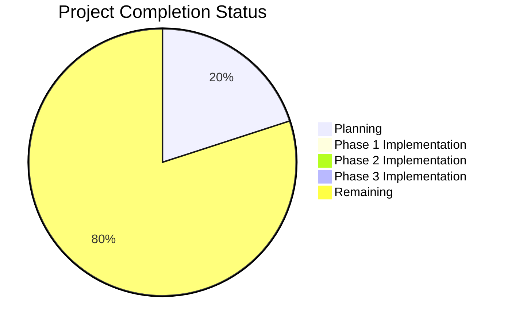

# Chess Video Analysis Application - Progress

## Project Status Overview

Current Status: **Initial Planning Phase**

## What Works

- ✅ Project scope and requirements defined
- ✅ Technical architecture designed
- ✅ Development phases outlined
- ✅ Memory bank documentation established

## What's In Progress

- 🔄 Development environment setup planning
- 🔄 Technical approach refinement
- 🔄 Component relationship definition
- 🔄 Implementation strategy formulation

## What's Left to Build

### Phase 1: Python Library
- ⬜ Video input handling
- ⬜ Frame extraction
- ⬜ Chess board detection
- ⬜ Board perspective normalization
- ⬜ Piece recognition
- ⬜ Position extraction (FEN generation)
- ⬜ Move tracking
- ⬜ PGN generation
- ⬜ Command-line interface
- ⬜ Visual feedback system
- ⬜ Testing suite

### Phase 2: Web Service
- ⬜ REST API design
- ⬜ Video stream handling
- ⬜ Backend service architecture
- ⬜ API endpoints implementation
- ⬜ Response formatting
- ⬜ Error handling
- ⬜ Performance optimization
- ⬜ Documentation

### Phase 3: Frontend
- ⬜ React application setup
- ⬜ TypeScript configuration
- ⬜ ShadCN UI integration
- ⬜ Video display component
- ⬜ Lichess board integration
- ⬜ API service integration
- ⬜ User controls
- ⬜ Responsive design
- ⬜ Testing and optimization

## Implementation Progress

### Backend Components

| Component | Status | Progress | Notes |
|-----------|--------|----------|-------|
| Video Input Handler | Not Started | 0% | - |
| Frame Extractor | Not Started | 0% | - |
| Board Detector | Not Started | 0% | - |
| Position Extractor | Not Started | 0% | - |
| Move Tracker | Not Started | 0% | - |
| PGN/FEN Generator | Not Started | 0% | - |
| Chess Logic Engine | Not Started | 0% | - |
| Command-Line Interface | Not Started | 0% | - |

### Web Service Components

| Component | Status | Progress | Notes |
|-----------|--------|----------|-------|
| REST API | Not Started | 0% | Phase 2 |
| Video Processor | Not Started | 0% | Phase 2 |
| Response Formatter | Not Started | 0% | Phase 2 |

### Frontend Components

| Component | Status | Progress | Notes |
|-----------|--------|----------|-------|
| Video Display | Not Started | 0% | Phase 3 |
| Chess Board Display | Not Started | 0% | Phase 3 |
| User Controls | Not Started | 0% | Phase 3 |
| API Integration | Not Started | 0% | Phase 3 |

## Testing Progress

| Test Type | Status | Progress | Notes |
|-----------|--------|----------|-------|
| Unit Tests | Not Started | 0% | - |
| Integration Tests | Not Started | 0% | - |
| Performance Tests | Not Started | 0% | - |
| User Acceptance Tests | Not Started | 0% | - |

## Known Issues and Challenges

1. **Technical Challenges**
   - Accurate chess board detection in various lighting conditions
   - Reliable piece recognition with different piece styles
   - Real-time processing performance optimization
   - Handling ambiguous moves or partially obscured pieces

2. **Implementation Risks**
   - Computer vision accuracy limitations
   - Processing speed vs. accuracy trade-offs
   - Integration complexity between Python backend and React frontend
   - Real-time streaming performance

3. **Open Questions**
   - Best approach for board detection algorithm
   - Optimal piece recognition strategy
   - Error handling and recovery mechanisms
   - Performance optimization opportunities

## Next Milestone Target

**Milestone 1: Basic Video Processing**
- Target Completion: After environment setup
- Key Deliverables:
  - Working video frame extraction
  - Basic chess board detection
  - Board perspective normalization

## Recent Achievements

- Project initialization completed
- Memory bank documentation created
- Technical architecture defined
- Development approach established

## Blockers

- None currently identified

## Notes and Observations

- Project is in early planning stages
- Focus is on establishing solid architectural foundation
- Need to prioritize core video processing functionality first
- Should consider creating test datasets with various board styles and lighting conditions
