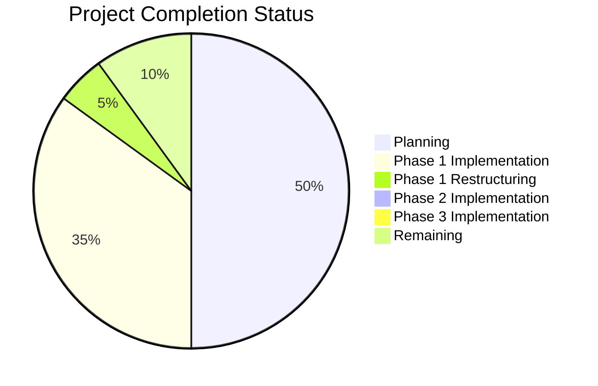

# Chess Video Analysis Application - Progress

## Project Status Overview

Current Status: **Project Restructuring In Progress**

## What Works

- ✅ Project scope and requirements defined
- ✅ Technical architecture designed
- ✅ Development phases outlined
- ✅ Memory bank documentation established
- ✅ Initial project structure created
- ✅ Core video processing pipeline implemented
- ✅ Board detection algorithm implemented
- ✅ Position extraction implemented
- ✅ Move tracking implemented
- ✅ PGN/FEN generation implemented
- ✅ Command-line interface implemented
- ✅ Basic visualization system implemented
- ✅ Initial testing framework set up
- ✅ New three-component architecture designed

## What's In Progress

- 🔄 Project restructuring into three components
- 🔄 Memory bank documentation updates
- 🔄 Planning migration path for existing code
- 🔄 Defining interfaces between components

## What's Left to Build

### Phase 1: Core Library (chess-vision-lib)
- ⬜ Create new directory structure
- ⬜ Migrate existing code to new structure
- ⬜ Update imports and dependencies
- ⬜ Create new pyproject.toml
- ⬜ Migrate tests to new structure
- ⬜ Advanced piece recognition
- ⬜ Improved position validation
- ⬜ Enhanced move tracking
- ⬜ Comprehensive testing suite
- ⬜ Performance optimization
- ⬜ Support for different board styles
- ⬜ Better handling of lighting conditions

### Phase 2: Backend Service (chess-vision-service)
- ⬜ Create directory structure
- ⬜ Set up FastAPI application
- ⬜ Define API endpoints
- ⬜ Implement integration with core library
- ⬜ Add video stream handling
- ⬜ Implement response formatting
- ⬜ Add error handling
- ⬜ Implement authentication (if needed)
- ⬜ Performance optimization
- ⬜ Documentation

### Phase 3: Frontend (chess-vision-web)
- ⬜ Create directory structure
- ⬜ Set up React/TypeScript application
- ⬜ Configure RSPack
- ⬜ Set up ShadCN UI
- ⬜ Create component hierarchy
- ⬜ Implement video display component
- ⬜ Integrate Lichess board
- ⬜ Implement API client
- ⬜ Add user controls
- ⬜ Implement responsive design
- ⬜ Testing and optimization

## Implementation Progress

### Core Library Components

| Component | Status | Progress | Notes |
|-----------|--------|----------|-------|
| Video Input Handler | Implemented | 90% | Needs migration to new structure |
| Frame Extractor | Implemented | 90% | Needs migration to new structure |
| Board Detector | Implemented | 70% | Needs migration and refinement |
| Position Extractor | Implemented | 60% | Needs migration and improvement |
| Move Tracker | Implemented | 70% | Needs migration and refinement |
| PGN/FEN Generator | Implemented | 80% | Needs migration |
| Chess Logic Engine | Implemented | 70% | Needs migration |
| Command-Line Interface | Implemented | 80% | Needs migration |

### Backend Service Components

| Component | Status | Progress | Notes |
|-----------|--------|----------|-------|
| Project Structure | Not Started | 0% | Planned |
| REST API | Not Started | 0% | Planned |
| Video Processor | Not Started | 0% | Planned |
| Library Integration | Not Started | 0% | Planned |
| Response Formatter | Not Started | 0% | Planned |

### Frontend Components

| Component | Status | Progress | Notes |
|-----------|--------|----------|-------|
| Project Structure | Not Started | 0% | Planned |
| Video Display | Not Started | 0% | Planned |
| Chess Board Display | Not Started | 0% | Planned |
| User Controls | Not Started | 0% | Planned |
| API Integration | Not Started | 0% | Planned |

## Testing Progress

| Test Type | Status | Progress | Notes |
|-----------|--------|----------|-------|
| Unit Tests | In Progress | 20% | Need migration to new structure |
| Integration Tests | Not Started | 0% | - |
| Performance Tests | Not Started | 0% | - |
| User Acceptance Tests | Not Started | 0% | - |

## Known Issues and Challenges

1. **Technical Challenges**
   - Ensuring smooth migration of existing code to new structure
   - Maintaining functionality during restructuring
   - Designing clean interfaces between components
   - Managing dependencies between components during development

2. **Implementation Risks**
   - Breaking existing functionality during migration
   - Introducing new bugs in restructured code
   - Ensuring consistent behavior across components
   - Managing increased complexity with three separate components

3. **Open Questions**
   - Best approach for dependency management between components
   - Testing strategy for the new structure
   - Deployment strategy for the three components
   - Development workflow across components

## Next Milestone Target

**Milestone: Project Restructuring**
- Target Completion: 2 weeks
- Key Deliverables:
  - New directory structure created
  - Core library migrated to new structure
  - Backend service skeleton implemented
  - Frontend application skeleton implemented
  - Basic integration between components

## Recent Achievements

- New three-component architecture designed
- Memory bank documentation updated to reflect new structure
- Migration plan created
- Interfaces between components defined

## Blockers

- None currently identified

## Notes and Observations

- The new structure will improve separation of concerns and maintainability
- The modular design will allow for independent development and deployment
- The clear interfaces between components will make the system more robust
- The restructuring is a necessary step before adding new features
