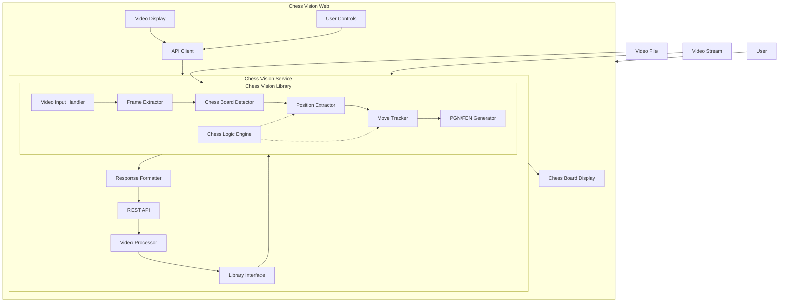
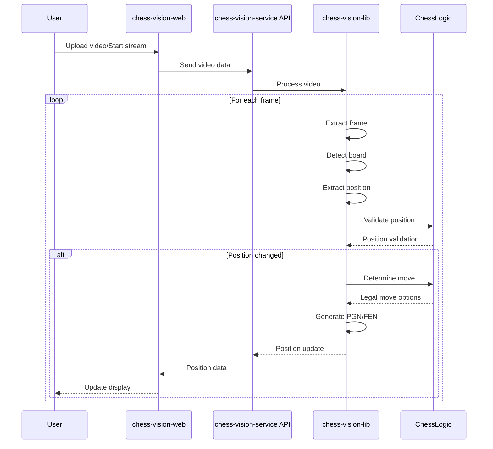

# Chess Video Analysis Application - System Patterns

## System Architecture

## Component Relationships

### Chess Vision Library Components

1. **Video Input Handler**
   - Accepts video files or streams
   - Validates input format and quality
   - Prepares video for processing

2. **Frame Extractor**
   - Extracts individual frames from video
   - Handles different frame rates
   - Optimizes frame selection for processing

3. **Chess Board Detector**
   - Identifies chess board in frame
   - Handles different board angles and lighting
   - Normalizes board perspective

4. **Position Extractor**
   - Identifies chess pieces on the board
   - Maps pieces to board coordinates
   - Generates position representation (FEN)

5. **Move Tracker**
   - Compares consecutive positions
   - Identifies moves made
   - Validates moves against chess rules

6. **PGN/FEN Generator**
   - Converts detected moves to standard notation
   - Maintains game history
   - Formats output according to specifications

7. **Chess Logic Engine**
   - Provides rules of chess
   - Validates legal moves
   - Improves move detection accuracy

### Chess Vision Service Components

1. **REST API**
   - Handles HTTP requests and responses
   - Manages authentication and authorization
   - Provides endpoints for video processing

2. **Video Processor**
   - Handles streaming video input
   - Manages processing state
   - Coordinates with library components

3. **Library Interface**
   - Provides clean integration with chess-vision-lib
   - Handles data conversion between service and library
   - Manages library configuration

4. **Response Formatter**
   - Structures API responses
   - Formats chess data for frontend consumption
   - Handles error responses

### Chess Vision Web Components

1. **Video Display**
   - Shows original video feed
   - Provides playback controls
   - Highlights detected board and moves

2. **Chess Board Display**
   - Renders current position using Lichess board
   - Updates in real-time with detected moves
   - Provides interactive analysis features

3. **User Controls**
   - Video upload/stream selection
   - Processing options and settings
   - Analysis tools and preferences

4. **API Client**
   - Handles communication with backend service
   - Manages authentication
   - Processes API responses

## Data Flow Patterns

## Key Technical Decisions

1. **Three-Tier Architecture**
   - Separation of core library, service layer, and frontend
   - Clear boundaries between components
   - Independent development and deployment
   - Reusable core library across different applications

2. **Python for Core Library and Service**
   - Strong libraries for computer vision (OpenCV)
   - Excellent machine learning support
   - Rich ecosystem for chess programming
   - FastAPI for efficient web service

3. **React/TypeScript for Frontend**
   - Type safety for complex chess data structures
   - Component-based UI for chess visualization
   - Strong ecosystem for interactive applications
   - ShadCN UI for consistent design

4. **REST API for Communication**
   - Stateless communication between frontend and backend
   - Standard HTTP methods for resource operations
   - JSON for data exchange
   - Clear API contract

5. **Lichess Board Integration**
   - Leverage existing, well-tested chess visualization
   - Access to analysis tools
   - Familiar interface for chess players

6. **Chess Logic for Move Validation**
   - Improve accuracy by considering legal moves
   - Reduce false positives in piece detection
   - Handle edge cases in chess rules

## Design Patterns

1. **Pipeline Pattern**
   - Sequential processing of video frames
   - Clear separation of concerns between stages
   - Easy to extend or modify individual components

2. **Observer Pattern**
   - Position changes notify subscribers
   - Frontend components react to backend updates
   - Decoupled communication between components

3. **Strategy Pattern**
   - Pluggable algorithms for board detection
   - Configurable piece recognition strategies
   - Adaptable to different board styles and pieces

4. **Factory Pattern**
   - Create appropriate processors based on video type
   - Generate correct notation based on game context
   - Instantiate proper analysis tools based on user preferences

5. **Repository Pattern**
   - Abstract data storage and retrieval
   - Separate business logic from data access
   - Enable different storage backends (file, database)

6. **Adapter Pattern**
   - Interface between chess-vision-lib and chess-vision-service
   - Convert between library data structures and API formats
   - Isolate changes in either component
