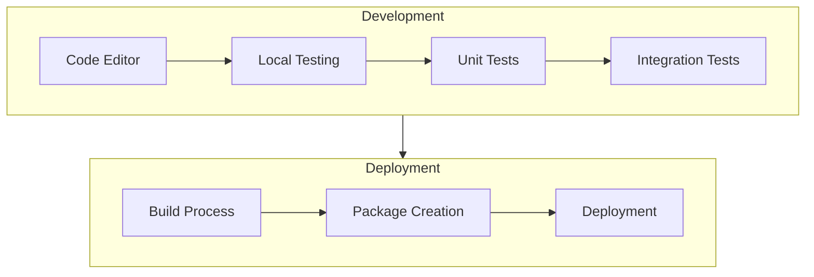

# Chess Video Analysis Application - Technical Context

## Technology Stack

### Chess Vision Library (Python)

#### Core Technologies
- **Python 3.9+**: Main programming language for library development
- **OpenCV**: Computer vision library for video processing and image analysis
- **python-chess**: Chess representation and move validation
- **NumPy**: Numerical computing for image processing

#### Development Tools
- **Poetry**: Dependency management and packaging
- **Pytest**: Testing framework
- **Mypy**: Static type checking
- **Black**: Code formatting
- **Flake8**: Linting
- **Docker**: Containerization for deployment

### Chess Vision Service (Python)

#### Core Technologies
- **FastAPI**: Web framework for API development
- **Uvicorn/Gunicorn**: ASGI server for FastAPI deployment
- **Pydantic**: Data validation and settings management
- **SQLAlchemy** (optional): Database ORM if persistence is needed
- **chess-vision-lib**: Core library for chess video analysis

#### Development Tools
- **Poetry**: Dependency management and packaging
- **Pytest**: Testing framework
- **Mypy**: Static type checking
- **Black**: Code formatting
- **Flake8**: Linting
- **Docker**: Containerization for deployment

### Chess Vision Web (TypeScript/React)

#### Core Technologies
- **TypeScript 4.9+**: Type-safe JavaScript
- **React 18+**: UI library
- **ShadCN UI**: Component library based on Tailwind CSS
- **Lichess Board**: Chess board visualization
- **Axios**: HTTP client for API communication

#### Development Tools
- **RSPack**: Bundler (specified requirement)
- **ESLint**: Linting
- **Prettier**: Code formatting
- **Jest**: Testing framework
- **React Testing Library**: Component testing

## Development Environment Setup

### Chess Vision Library Setup
```bash
# Create project directory
mkdir -p chess-vision-lib
cd chess-vision-lib

# Set up Python environment with Poetry
poetry init
poetry add opencv-python python-chess numpy
poetry add --dev pytest mypy black flake8

# Create project structure
mkdir -p src/chess_vision/{board,position,moves,notation,video,utils}
touch src/chess_vision/__init__.py
```

### Chess Vision Service Setup
```bash
# Create project directory
mkdir -p chess-vision-service
cd chess-vision-service

# Set up Python environment with Poetry
poetry init
poetry add fastapi uvicorn pydantic
poetry add --dev pytest mypy black flake8

# Add local library as dependency (development)
poetry add -e ../chess-vision-lib

# Create project structure
mkdir -p src/chess_vision_service/{api,models,services,utils}
touch src/chess_vision_service/__init__.py
```

### Chess Vision Web Setup
```bash
# Create project directory
mkdir -p chess-vision-web
cd chess-vision-web

# Initialize package
npm init -y

# Install dependencies
npm install react react-dom typescript @types/react @types/react-dom
npm install @rspack/cli @rspack/core

# Install ShadCN UI
npm install tailwindcss postcss autoprefixer
npm install @shadcn/ui

# Create project structure
mkdir -p src/{components,hooks,services,utils,pages}
```

## Technical Constraints

### Video Processing
- **Performance**: Real-time or near-real-time processing required
- **Accuracy**: Must handle various lighting conditions and angles
- **Resource Usage**: Optimize for reasonable CPU/memory consumption
- **Video Formats**: Support common formats (MP4, AVI, WebM)
- **Resolution**: Handle various video resolutions effectively

### Chess Logic
- **Rules Compliance**: Adhere to standard chess rules
- **Notation Standards**: Follow PGN and FEN specifications
- **Edge Cases**: Handle special moves (castling, en passant, promotion)
- **Validation**: Verify moves against legal chess moves

### Web Service
- **Scalability**: Handle multiple concurrent video streams
- **Latency**: Minimize processing and response time
- **Error Handling**: Graceful failure and informative errors
- **Security**: Protect against common web vulnerabilities

### Frontend
- **Responsiveness**: Adapt to different screen sizes
- **Performance**: Smooth playback and board updates
- **Accessibility**: Follow WCAG guidelines
- **Browser Compatibility**: Support modern browsers

## Dependencies

### Chess Vision Library Dependencies

#### Core Libraries
- **OpenCV (cv2)**: Computer vision operations
  - Board detection
  - Image preprocessing
  - Contour detection
  - Perspective transformation

- **python-chess**: Chess logic and notation
  - Board representation
  - Move validation
  - FEN/PGN generation
  - Game state tracking

- **NumPy**: Numerical operations
  - Image array manipulation
  - Mathematical operations
  - Performance optimization

### Chess Vision Service Dependencies

#### Core Libraries
- **FastAPI**: API framework
  - Endpoint definitions
  - Request/response handling
  - WebSocket support for streaming
  - Documentation (Swagger/OpenAPI)

- **Pydantic**: Data validation
  - Input validation
  - Schema definition
  - Configuration management

- **chess-vision-lib**: Core functionality
  - Video processing
  - Board detection
  - Position extraction
  - Move tracking

### Chess Vision Web Dependencies

#### UI Components
- **React**: UI rendering
- **ShadCN UI**: Pre-styled components
- **Tailwind CSS**: Utility-first styling

#### Chess Visualization
- **Lichess Board API**: Chess board rendering
  - Position display
  - Move animation
  - Analysis features

#### Build Tools
- **RSPack**: Asset bundling
  - JavaScript/TypeScript compilation
  - CSS processing
  - Asset optimization

## Development Workflow



1. **Chess Vision Library Development**
   - Implement core video processing pipeline
   - Develop chess position extraction
   - Create move tracking logic
   - Build command-line interface
   - Test with sample videos

2. **Chess Vision Service Development**
   - Design API endpoints
   - Implement request/response handling
   - Add streaming support
   - Secure and optimize API
   - Test with API clients

3. **Chess Vision Web Development**
   - Create React application structure
   - Implement UI components
   - Integrate with Lichess board
   - Connect to backend API
   - Test user interactions

## Testing Strategy

1. **Unit Testing**
   - Test individual components in isolation
   - Mock dependencies for controlled testing
   - Verify component behavior

2. **Integration Testing**
   - Test component interactions
   - Verify end-to-end workflows
   - Test with real video samples

3. **Performance Testing**
   - Measure processing speed
   - Evaluate resource usage
   - Test with various video inputs

4. **User Testing**
   - Verify usability
   - Collect feedback
   - Iterate on design
